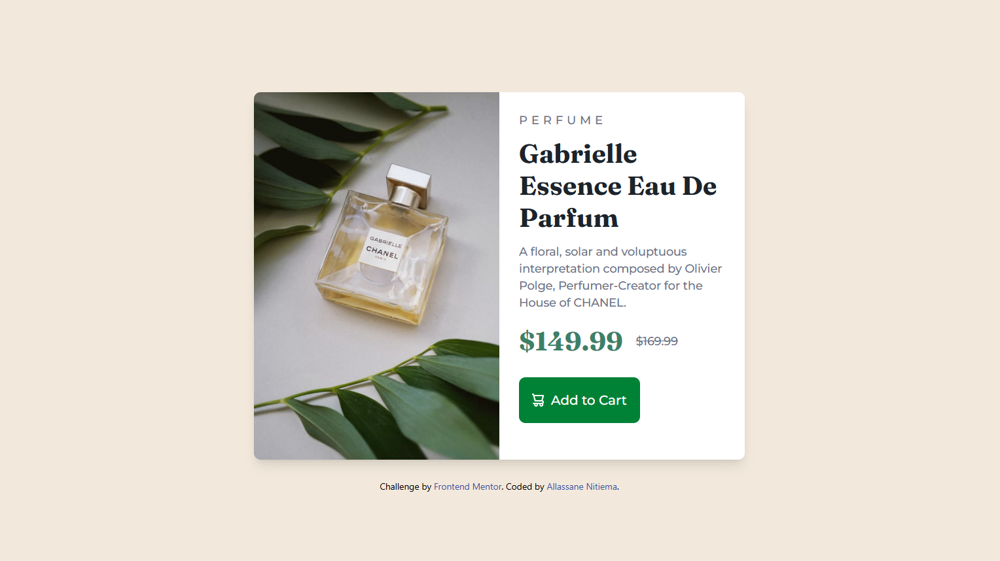
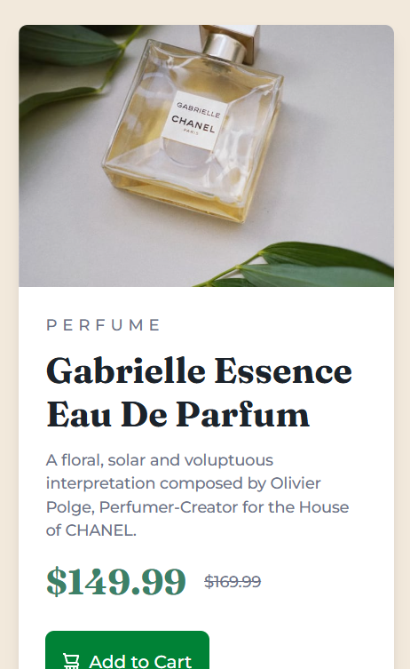
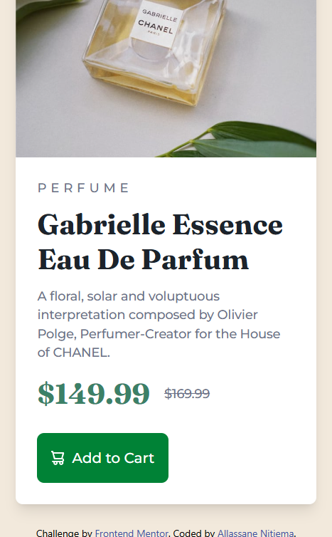

# Frontend Mentor - Product Preview Card Component Solution

This is my solution to the Product Preview Card Component challenge on Frontend Mentor. Frontend Mentor challenges help you improve your coding skills by building realistic projects.

## Table of Contents

- [Overview](#overview)
  - [The Challenge](#the-challenge)
  - [Screenshot](#screenshot)
  - [Links](#links)
- [My Process](#my-process)
  - [Built With](#built-with)
  - [What I Learned](#what-i-learned)
  - [Continued Development](#continued-development)
  - [Useful Resources](#useful-resources)
- [Author](#author)
- [Acknowledgments](#acknowledgments)

## Overview

### The Challenge

Users should be able to:

- View the optimal layout depending on their device's screen size.
- See hover and focus states for interactive elements.

### Screenshot





### Links

- Solution URL: [Frontend Mentor](https://www.frontendmentor.io/solutions/responsive-product-card-built-with-tailwind-css-9JYAW0hZCG)
- Live Site URL: [Vercel](https://vercel.com/nitiema-s-projects/product-card-frontend-mentor-9bnf)

## My Process

### Built With

- Semantic HTML5 markup
- Tailwind CSS
- CSS Grid
- Mobile-first workflow

### What I Learned

I learned how to use the `srcset` attribute to make images responsive across different screen sizes. Here's an example of how I implemented it:

```html
    <div class="image sm:w-[50%] h-full overflow-hidden">
      <picture>
        <source media="(min-width: 640px)" srcset="../images/image-product-desktop.jpg">
        
      </picture>
    </div>
```

This allows the browser to choose the appropriate image based on the screen size, improving the performance and responsiveness of the website.

### Continued Development

In the future, I plan to further enhance this project by:

- Experimenting with more interactive features, like modals or product zoom.
- Improving accessibility by adding ARIA labels and roles.
- Testing cross-browser compatibility to ensure a consistent experience for all users.

### Useful Resources

- [Tailwind CSS v4](https://tailwindcss.com/) - This framework helped me build a responsive, mobile-first layout quickly and efficiently. I love the utility-first approach, and I will continue to use it for future projects.
- [Frontend Mentor](https://www.frontendmentor.io) - A fantastic resource for improving front-end skills through real-world challenges.

## Author

- Frontend Mentor - [@NitiemaDev](https://www.frontendmentor.io/profile/NitiemaDev)

## Acknowledgments

Thanks to the Frontend Mentor community for the helpful feedback and support throughout this project. I learned a lot from this challenge and look forward to taking on more!
